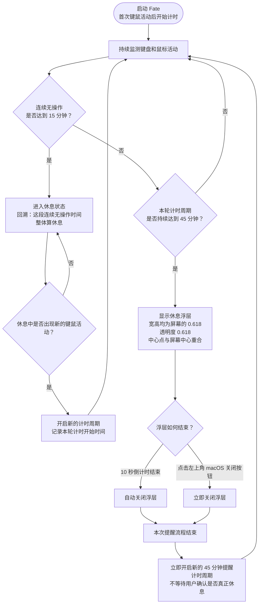

本项目基于https://github.com/tauri-apps/tauri 构建，参考https://github.com/zerosoul/chinese-colors 的配色，通过轻量监测键盘鼠标和屏幕活动，提醒人类定时休息，macOS优先


## 代码风格

1. 代码是负债不是资产，用越少的代码实现核心功能越好
2. 高内聚，低耦合

## 设计风格

使用黑白灰风格，使用 shadcn/ui 组件库，参考 manus.im 与 notion.com 两个网站的风格


## 它是干嘛的

很多人一坐电脑前就是几个小时，等反应过来已经腰酸背痛了。Fate就是来解决这个问题的——它在后台默默观察你的活动状态，发现你连续工作太久，就会提醒你休息一会儿。

## 它怎么知道你在忙？

它悄悄看看你的鼠标有没有动、键盘有没有敲。然后根据一套简单的规则来判断：

- 启动软件后，从第一次敲键盘或动鼠标开始，它开始记录工作时长。
- 中间去倒杯水、回个消息、发个呆，只要没连续歇够15分钟，都算工作。当连续 15 分钟没有键鼠活动时，系统判定用户已进入休息状态，并将这段连续无操作时间整体视为休息（带了回溯）。
- 正在休息时不需要提醒休息。休息状态下，一旦检测到新的键鼠操作，就认为用户重新开始工作，并开启新的计时周期。
- 如果从本轮计时开始起，同一个计时周期持续达到 45 分钟，且中间没有出现连续 15 分钟以上的休息，软件会提醒休息。
- 软件并不需要人类通过点击来进行定时。通过采集键鼠行为，自动化提醒。
- **浮层提醒** — 浮层宽度占屏幕宽度0.618，高度占屏幕的0.618，浮层透明度为0.618，浮层中心点与屏幕实际的中心点重合，浮层有个10秒倒计时，倒计时结束浮层自动消失，浮层自动消失后，与用户点击关闭按钮效果一致。浮层左上角有一个 macOS 风格的关闭按钮，点击后立即关闭浮层。
- 浮层关闭或自动消失后，本次提醒流程结束，系统立即开启新的 45 分钟提醒计时周期。用户是否真正休息，不影响下一轮提醒计时。

## 软件流程图




## 数据存储

使用 @tauri-apps/plugin-sql + SQLite 支持持久化存储

## 打包偏好

- Windows 版本默认交付双击即可运行的 portable 包，例如 `Fate_0.1.0_windows_portable.zip`，里面放可直接运行的 `.exe`。
- 这是一个小工具，Windows 分发不需要安装器；NSIS/MSI 安装包只在用户明确要求时再生成或作为附加产物。

## 软件界面


### 第一个Tab：当日

显示当天的休息时间和工作时间，休息时间为绿色，工作时间为金色，主体是一个类似Apple watch的拟物化圆环，圆环底部显示工作时间，休息时间

### 第二个Tab: 往日

一个万年历风格的统计图，每个日期格子后面有一个环状图

### 第三个Tab：AI健康

#### 给出健康建议

#### 测算今日运势

#### 今日趋吉避凶摆件


### 第四个Tab：成就

暗黑破坏神2：模拟挂机；
每分钟自动生成一条战斗日志，升级角色；

### 第五个Tab：设置

#### 系统权限


#### 个性化记忆

```
我是一个男性程序员
XXXX年XX月XX日生人
最近屏幕看久了，眼睛有些干涩
```

#### 生辰信息

#### 时间设置

- 工作时间（默认45分钟）
- 休息时间（默认15分钟）


#### 大模型设置

默认openai格式

base_url: https://api.deepseek.com

model: deepseek-v4-flash/deepseek-v4-pro

api_key: 

基于个人信息，测试大模型给出健康建议tips，获取输出


#### 导入/导出数据

- 将所有数据导出为一个zip包
- 通过导入zip包初始化软件设置
