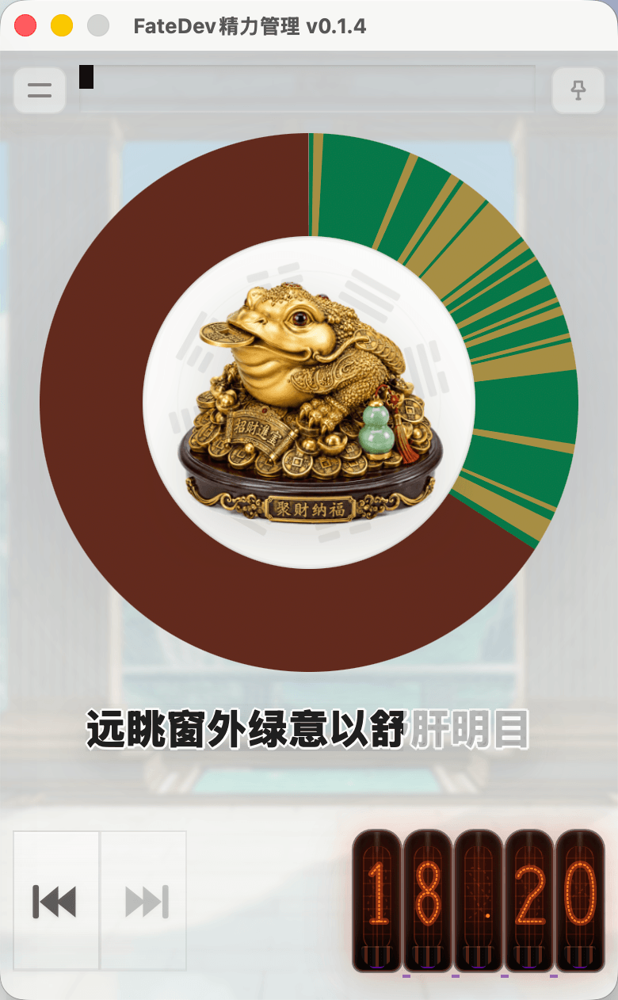
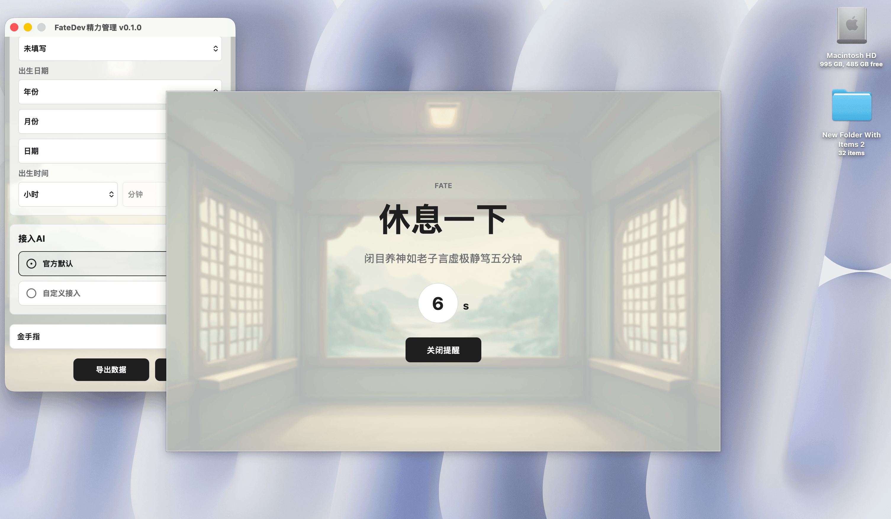

# Fate精力管理

Fate是一个精力管理桌面应用。它通过读取键盘鼠标点击动作，判断用户是否过劳，提醒用户休息，做时间的朋友。

朋友们，活着才能做时间的朋友！本软件会鼓励你多休息，希望你活得久一点。

## 为什么要做这个软件？

AI减少了人类的重复性工作，可以帮人类写报告，写代码，但增加了写prompt的时间，增加了审查AI生成内容的时间。

我在Vibe coding的过程中，会开几个窗口，虽然提升了效率，但精力会消耗的非常严重。

精力管理是长寿人类的必修课，即使每天工作4小时，如果无法及时提醒自己休息，也会造成大脑过劳。

如果大脑过劳，即使下班了，也没有精力享受生活，只想休息。

于是我开发了这个名为Fate的软件，在持续工作45分钟的时候，它会提醒我休息15分钟。

Fate不需要像番茄钟一样定时，它会自动读取用户的键鼠点击事件，判断用户是否在持续工作。



每个小时对应一个圆环，圆环默认红色，每10秒钟作为一次样本，如果10秒内有键鼠点击动作，就绘制一条黄线，如果没有动作就绘制一条绿线。

底部的按钮可以切换查看今日每小时的工作状况。


如果45分钟内没有15分钟的连续休息，就会弹窗提醒。



如果用户在提醒后确实休息了15分钟，就会收到一个星星奖励，星星可以用于解锁更多趋吉避凶风水摆件。


## 特色功能

### 日常保健

软件支持录入个人的身体状况，比如最近眼睛发干，睡眠质量不好，软件可以通过AI大模型自动给出保健小建议，在软件界面轮番播放

### 强运加持

软件可以根据软件使用者的性别年龄生辰八字，提供每日的风水小摆件（通过按时休息解锁更多摆件），祝你趋吉避凶，平安喜乐。


## 开发

```bash
npm install
npm run dev
```

开发模式启动的应用名为 `FateDev`，bundle identifier 为 `com.zhaoolee.fatedev`。
发布构建仍然使用 `Fate` 与 `com.zhaoolee.fate`。
SQLite 数据库位于 Tauri 的应用配置目录下，因此开发环境和发布环境会使用不同的数据目录。

## 构建

```bash
npm run build
```

构建产物：

- `src-tauri/target/release/bundle/macos/Fate.app`
- `src-tauri/target/release/bundle/dmg/Fate_*.dmg`
- Windows 包位于 `src-tauri/target/release/bundle/` 下对应的 Windows 子目录中

## macOS自签名

```
sudo xattr -rd com.apple.quarantine /Applications/Fate.app
```

## 环境

- Node.js 24+
- Rust stable 1.77.2+，当前已验证 `rustc 1.96.0`
